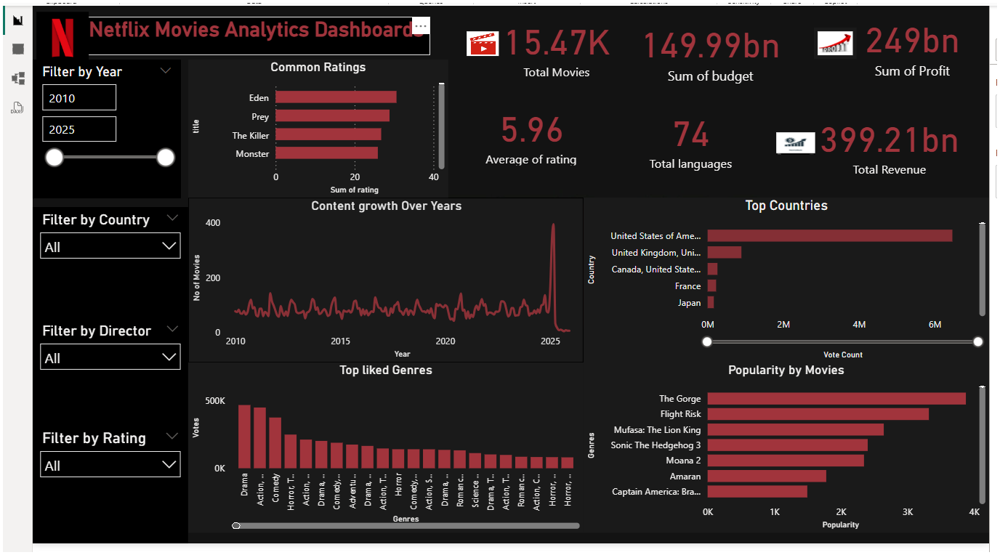

# Netflix Data Analysis Using Python and Power BI

## Project Overview

This project is an end-to-end analysis of Netflix movie data using Python and Power BI.

Python libraries such as Pandas and NumPy were used for data cleaning, preparation, and exploratory data analysis. The cleaned dataset was then used in Power BI to create an interactive dashboard for visualizing content, ratings, countries, genres, popularity, and financial information.

## Tools and Technologies Used

- Python
- Pandas
- NumPy
- Power BI
- GitHub

## Project Workflow

Raw Dataset  
↓  
Data Cleaning and Preparation using Python  
↓  
Exploratory Data Analysis  
↓  
Financial Analysis  
↓  
Creation of Cleaned Dataset  
↓  
Power BI Dashboard Development  
↓  
Data Visualization and Insights

## Data Cleaning and Preparation

The following data preparation steps were performed using Python and Pandas:

- Loaded the Netflix dataset from a CSV file
- Inspected the dataset using methods such as `head()`, `tail()`, `describe()`, `info()`, and `dtypes`
- Checked the dataset structure and column names
- Removed the `duration` column
- Checked for missing values
- Replaced missing values in selected categorical columns with `Unknown`
- Checked for duplicate records
- Removed leading and trailing spaces from categorical columns
- Renamed the `date_added` column to `Date_time`
- Checked the minimum and maximum release years
- Created a new `profit` column using the following formula:

Profit = Revenue - Budget

- Exported the cleaned dataset for further analysis and visualization

## Exploratory Data Analysis

The Python analysis includes exploration of:

- Content type distribution
- Languages with the most content
- Rating categories
- Content type by language
- Revenue by content type
- Average popularity by genre
- Average rating by language
- Highest-rated titles
- Unique languages
- Most common genres
- Revenue generated by genres
- Countries producing the most content

## Financial Analysis

The financial analysis includes:

- Calculation of profit for each title
- Identification of titles with high profit
- Analysis of the relationship between budget and revenue using correlation

## Power BI Dashboard

The cleaned dataset was used to create the **Netflix Movies Analytics Dashboard** in Power BI.

The dashboard presents key metrics and visualizations related to Netflix movie data.

### Key Dashboard Metrics

The dashboard includes:

- Total Movies
- Sum of Budget
- Sum of Profit
- Average Rating
- Total Languages
- Total Revenue

### Dashboard Visualizations

The Power BI dashboard includes analysis such as:

- Content Growth Over Years
- Top Countries
- Popularity by Movies
- Top Liked Genres
- Common Ratings
- Year Filtering
- Country Filtering
- Director Filtering
- Rating Filtering

These interactive filters allow users to explore the Netflix dataset based on different dimensions.

## Dashboard Preview
 

## Project Structure

```text
Netflix-Data-Analysis-Python-PowerBI/
│
├── README.md
│
├── data/
│   ├── raw/
│   │   └── netflix_movies_raw_data.csv
│   │
│   └── cleaned/
│       └── Netflix_clean_data.csv
│
├── python/
│   └── netflix_data_analysis.py
│
├── powerbi/
│   └── Netflix_Dashboard.pbix
│
└── images/
    └── Netflix_Dashboard_Image.png
```

### Raw Dataset
Contains the original Netflix movie dataset used for the project.

### Cleaned Dataset
Contains the processed dataset after data cleaning and transformation.

### Python Analysis
Contains the Python code used for data cleaning, exploratory data analysis, and financial analysis.

### Power BI Dashboard
Contains the interactive Power BI dashboard developed for data visualization and analysis.

### Dashboard Image
Contains a preview of the final Netflix Movies Analytics Dashboard.

## Skills Demonstrated

- Data Cleaning
- Data Preparation
- Exploratory Data Analysis
- Financial Analysis
- Pandas
- NumPy
- Data Visualization
- Power BI
- Dashboard Development
- Data Interpretation
- GitHub Project Documentation

## Conclusion

This project demonstrates an end-to-end data analysis workflow using Python and Power BI.

Python and Pandas were used to clean, transform, and analyze the Netflix movie dataset. A cleaned dataset was then prepared and used in Power BI to create an interactive dashboard.

The project demonstrates how raw data can be processed and transformed into visual insights using data analysis and visualization tools.
